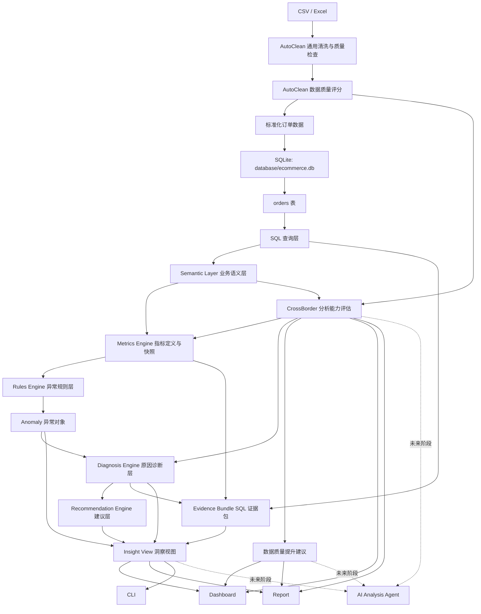

# 跨境电商本地商业分析系统 PRD v2.5

版本：v2.5  
当前阶段：Phase 1 已完成 / Phase 2 启动  
产品定位：面向未来 AI 商业分析 Agent 的指标、规则、洞察与数据可信度基础设施

## 一、核心定义

跨境电商本地商业分析系统是一个面向跨境电商运营负责人的本地商业分析工具，通过 AutoClean 清洗、SQLite 数据层、SQL 查询层、指标层、规则层、洞察层和数据质量评估层，帮助用户发现经营问题、解释指标变化，并生成有证据链的行动建议。

产品当前不做：

- 不做云端 SaaS
- 不做多租户权限
- 不做实时数据同步
- 不做自动经营决策
- 不做 AI Agent 聊天框
- 不在缺少关键字段时生成伪结论

## 二、目标用户

Primary User：

跨境电商运营负责人。

核心决策问题：

- 哪些 SKU 值得继续投入？
- 哪些 SKU 应该观察、优化或下架？
- 哪些市场值得加预算？
- 哪些市场增长不健康？
- 为什么销售额、利润率、退货率发生变化？
- 下一步优先处理哪个经营问题？

Secondary User：

数据分析师。

关注点：

- 数据质量是否可信
- 指标口径是否统一
- SQL 查询是否可复用
- 报告结论是否可追溯
- 哪些结论受字段缺失影响

Demo User：

个人作品集、创业 Demo、未来 AI Agent 项目展示使用者。

关注点：

- 系统闭环是否完整
- 是否体现数据层、指标层、规则层、洞察层
- 是否为 Agent 调用预留稳定接口

## 三、用户决策频率

| 场景 | 周期 | 关键问题 |
|---|---|---|
| 周经营复盘 | 每周 | 销售是否异常，商品和市场是否有风险 |
| 月度经营分析 | 每月 | 哪些增长健康，哪些利润恶化 |
| 大促后复盘 | 活动后 | 增长是否来自促销，退货是否上升 |
| 新市场评估 | 上线前 / 投放前 | 市场是否值得投入 |
| 商品组合优化 | 每月 / 每季度 | 哪些 SKU 应该扩量、优化或淘汰 |

## 四、系统架构



核心原则：

- AutoClean 负责通用数据清洗、契约校验和基础数据质量评分。
- CrossBorder 项目负责跨境电商业务语义、经营分析能力评估和数据提升建议。
- SQL 负责事实查询。
- Python 负责业务推导。
- 指标、异常、诊断、建议和证据分别形成稳定对象，Insight 只负责聚合展示。
- 原因必须标记为已验证、较可能、无法判断或数据问题，不把相关性写成确定因果。
- 数据质量或分析能力不满足门槛时停止异常和经营建议，只输出限制与补数建议。
- Agent 未来只调用稳定指标、洞察和数据边界，不直接猜测数据库字段。

## 五、数据模型

### 当前物理模型

当前数据库仍以单表为主：

```text
orders
```

默认数据库：

```text
database/ecommerce.db
```

### 逻辑业务对象模型

分析层应抽象出：

```text
Order
Product
Customer
Market
Category
Metric
MetricDefinition
MetricSnapshot
AnomalyRule
Anomaly
DiagnosisResult
RecommendationRule
Recommendation
EvidenceBundle
InsightView
DataQuality
AnalysisCapability
ImprovementPlan
```

### 未来物理模型候选

Phase 2 / Phase 3 可扩展为：

```text
orders
products
customers
metrics_snapshot
anomalies
diagnoses
recommendations
evidence_bundles
insights
data_quality_snapshots
analysis_capabilities
data_improvement_plans
```

注意：

逻辑模型不等于当前数据库表结构。当前阶段可以继续用 `orders` 单表支撑分析，但业务层需要提前形成对象语言。

## 六、Semantic Layer 业务语义层

目标：

把数据库字段翻译成业务对象和业务概念，避免未来 Agent 直接理解底层字段。

示例：

| 数据字段 | 业务语义 |
|---|---|
| total_amount | GMV |
| profit_amount / cost | 利润能力 |
| returned / return_status | 退货状态 |
| country / region | 市场 |
| product_id | SKU |
| customer_id | 客户 |
| order_date | 经营周期 |

Semantic Layer 当前不需要做复杂框架，但需要在文档中明确：

- 字段含义
- 指标含义
- 对象含义
- 适用条件
- 不可回答的问题

## 七、指标体系

指标层不是指标名称清单，而是 Dashboard、CLI、报告、异常规则和未来 Agent 共用的唯一计算入口。

### 7.1 KPI 分层

Primary Outcome Metrics（核心结果指标）：

- GMV
- 利润
- 利润率

Driver Metrics（驱动指标）：

- 订单数
- 客单价
- 销量
- 客户数
- 商品贡献率
- 市场贡献率

Guardrail Metrics（保护指标）：

- 退货率
- 最小样本量
- 数据质量评分
- 分析能力状态

异常和建议不能只追求 GMV 增长，必须同时检查利润率和退货率等保护指标。

### 7.2 MetricDefinition 指标定义契约

每个指标必须在 Metrics Catalog 中注册：

```text
metric_id
name
business_meaning
formula
numerator
denominator
unit
currency_policy
grain
supported_dimensions
time_grain
comparison_mode
required_fields
minimum_sample
null_policy
zero_denominator_policy
quality_gate
capability_gate
source_query
version
owner
limitations
```

约束：

- `metric_id` 永久稳定，展示名称可以汉化或调整。
- 同一指标只有一个公式来源，页面和报告不能各自计算。
- 比率必须保留分子、分母，不能只保存最终百分比。
- 金额指标必须记录目标币种和汇率覆盖状态。
- 公式、数据源或边界变化时提升 `version`，历史快照保留原版本。

### 7.3 MetricSnapshot 指标快照

```text
snapshot_id
dataset_id
metric_id
metric_version
entity_type
entity_id
period_type
period_start
period_end
is_complete_period
current_value
numerator_value
denominator_value
sample_size
currency
quality_status
capability_status
evidence_id
calculated_at
```

快照是异常规则的唯一输入。异常规则不能绕过指标层重新计算指标。

### 7.4 Metrics Catalog v1

| metric_id | 指标 | 公式 | 主要粒度 | 主要来源 |
|---|---|---|---|---|
| `gmv` | GMV | `SUM(total_amount_base)` | 全局/市场/品类/SKU/周期 | `overview`、`monthly_sales` |
| `orders` | 订单数 | `COUNT(order_id)` | 全局/市场/品类/SKU/周期 | `overview`、各分析查询 |
| `aov` | 客单价 | `gmv / orders` | 全局/市场/品类/周期 | GMV 与订单数快照 |
| `units` | 销量 | `SUM(quantity)` | 全局/市场/品类/SKU/周期 | 各分析查询 |
| `customers` | 客户数 | `COUNT(DISTINCT customer_id)` | 全局/市场/周期 | `overview`、`customer_rfm_base` |
| `profit` | 利润 | `SUM(profit_amount_base)` | 全局/市场/品类/SKU/周期 | `overview`、各分析查询 |
| `profit_margin` | 利润率 | `profit / gmv` | 全局/市场/品类/SKU/周期 | 利润与 GMV 快照 |
| `return_rate` | 退货率 | `returned_orders / orders` | 全局/市场/品类/SKU/周期 | `return_analysis` |
| `growth_rate` | 增长率 | `(current - previous) / ABS(previous)` | 指标+对象+周期 | 两期指标快照 |
| `product_contribution` | 商品贡献率 | `product_gmv / filtered_total_gmv` | SKU/周期 | `product_analysis` |
| `market_contribution` | 市场贡献率 | `market_gmv / filtered_total_gmv` | 市场/周期 | `market_analysis` |

`profit_amount` 缺失时利润和利润率不可用，不允许用 GMV、售价或其他代理字段代替。`returned` 缺失时退货率不可用。

### 7.5 周期、比较与边界规则

- 月度异常只比较完整自然月；未完成月份可以展示，但不生成环比异常。
- 周度比较使用完整的周一至周日，并与前一个等长完整周比较。
- 活动复盘必须由用户明确给出活动期和等长对照期，v1 不自动选择活动基线。
- `previous_value = 0` 时不计算增长率，只输出绝对变化和“基期为零”。
- 分母为零时比率返回不可用，不返回 0%。
- 缺少必要字段、币种覆盖不足或能力状态为“不支持”时不生成快照。
- 日期型数据在 v1 按自然日处理；未来接入时间戳时必须在语义层配置经营时区。

### 7.6 SKU 生命周期 v1

生命周期仅使用完整月份，分类优先级为：低样本 → 新品 → 衰退品 → 成长品 → 成熟品 → 未分类。

```text
低样本：最近完整月订单数 < 10，或可观察完整月份 < 2
新品：首次订单距分析期末 <= 30 天，且累计订单数 >= 5
衰退品：最近两个完整月 GMV 环比均 <= -20%，且每月订单数 >= 10
成长品：最近两个完整月 GMV 环比均 > 0%，且每月订单数 >= 10
成熟品：已销售 >= 90 天，最近三个完整月 GMV 变异系数 <= 20%，且每月订单数 >= 10
未分类：满足分析样本，但不符合以上状态
```

生命周期是规则型经营标签，不是未来销量预测。数据不足时必须输出“低样本”，不能强行分类。

### 7.7 市场质量评分 v1

只对最近完整月订单数 >= 30、且 GMV、增长率、利润率、退货率全部可用的市场计算。

```text
市场质量评分 =
GMV 百分位得分 * 30%
+ 增长率百分位得分 * 25%
+ 利润率百分位得分 * 25%
+ 退货健康度得分 * 20%

退货健康度得分 = 100 - 退货率百分位得分
```

四项得分均在本次可比较市场集合内按百分位映射到 0-100。缺少任一指标时不重新分配权重，而是返回“不可评分”和缺失原因。v2 才支持按市场阶段配置权重。

## 八、数据质量与分析边界

数据质量模块不只是检查数据有没有问题，而是整个系统的“可信度和能力边界管理层”。

它需要回答：

```text
这份数据能不能信？
能支持哪些经营分析？
不能回答哪些商业问题？
为什么不能回答？
下一步补什么数据最有价值？
```

### 8.1 三层结构

```text
AutoClean 通用数据质量评分
↓
CrossBorder 经营分析能力地图
↓
数据质量提升建议
```

三层分别回答：

| 层级 | 回答问题 |
|---|---|
| AutoClean 数据质量评分 | 数据本身可靠吗？ |
| CrossBorder 分析能力地图 | 当前数据能支持什么商业分析？ |
| 数据质量提升建议 | 下一步应该补充或修复什么数据？ |

## 九、AutoClean 通用数据质量评分

AutoClean 负责通用数据质量，不理解跨境电商业务。

### 9.1 评分维度

v1 评分模型：

```text
数据质量评分 =
字段完整度 30%
+ 数据有效性 25%
+ 字段覆盖度 20%
+ 唯一性 15%
+ 时间连续性 10%
```

维度定义：

| 维度 | 含义 |
|---|---|
| 字段完整度 | 已有字段里空值多不多 |
| 数据有效性 | 类型、范围、格式、通用规则是否有效 |
| 字段覆盖度 | 契约要求的字段有没有 |
| 唯一性 | 粒度键是否重复 |
| 时间连续性 | 时间跨度是否可支撑趋势分析 |

### 9.2 数据可信度等级

| 等级 | 分数范围 | 使用建议 |
|---|---:|---|
| A级 | 90-100 | 可用于常规经营分析和日常决策 |
| B级 | 75-89 | 可用于趋势和结构分析，关键决策需关注风险 |
| C级 | 60-74 | 只建议探索分析，不建议直接做经营判断 |
| D级 | <60 | 不建议用于正式分析，需先修复数据 |

示例：

```text
数据质量评分：87/100
可信度等级：B级

解释：
当前数据可以支持销售趋势、市场贡献和商品销售排行。
由于缺少成本或利润字段，不建议用于盈利决策。
```

### 9.3 AutoClean 输出结构

```json
{
  "quality_score": 87,
  "quality_rating": "B",
  "quality_explanation": "可用于趋势和结构分析，关键决策需关注风险",

  "completeness": 90,
  "validity": 95,
  "field_coverage": 82,
  "uniqueness": 99,
  "time_coverage": 100,

  "fatal_issues": 0,
  "warning_issues": 2
}
```

## 十、字段级质量报告

整体评分之外，必须输出字段级健康度。

### 10.1 字段级报告结构

| 字段 | 业务含义 | 存在状态 | 完整率 | 有效率 | 唯一性 | 状态 | 影响分析 |
|---|---|---|---:|---:|---:|---|---|
| order_id | 订单ID | 已识别 | 100% | 100% | 100% | 优秀 | 支持订单粒度 |
| order_date | 订单日期 | 已识别 | 99.9% | 99.8% | - | 良好 | 支持趋势分析 |
| total_amount | 订单金额 | 已识别 | 100% | 100% | - | 优秀 | 支持 GMV 分析 |
| customer_id | 客户ID | 缺失 | 0% | - | - | 缺失 | 客户分析不可用 |
| profit_amount | 利润 | 缺失 | 0% | - | - | 缺失 | 利润分析不可用 |
| returned | 退货状态 | 缺失 | 0% | - | - | 缺失 | 退货风险分析不可用 |

### 10.2 字段状态

```text
优秀
良好
需关注
缺失
不可用
```

字段级报告用于：

- Dashboard 数据健康中心
- Excel `field_quality`
- DOCX 数据质量章节
- Agent 判断能力边界

## 十一、CrossBorder 经营分析能力地图

CrossBorder 不重复做通用评分，而是回答：

```text
当前数据可以支持哪些经营判断？
哪些判断不能做？
为什么？
```

### 11.1 能力状态

```text
完全支持
部分支持
不支持
```

### 11.2 示例能力地图

| 分析能力 | 状态 | 可以回答 | 不能回答 | 原因 |
|---|---|---|---|---|
| 销售分析 | 完全支持 | GMV、订单数、客单价、趋势 | - | 核心订单字段完整 |
| 商品分析 | 部分支持 | 商品销量、商品销售贡献 | 商品利润贡献 | 缺少成本或利润字段 |
| 利润分析 | 不支持 | - | 利润率、高销售低利润商品 | 缺少成本或利润字段 |
| 客户分析 | 不支持 | - | RFM、复购、高价值客户 | 缺少 customer_id |
| 市场分析 | 部分支持 | 市场 GMV、市场贡献 | 市场利润质量 | 缺少成本或利润字段 |
| 退货风险 | 不支持 | - | 高退货商品、高风险市场 | 缺少 returned / return_status |

### 11.3 分析能力门槛

| 能力 | 最低字段要求 | 额外门槛 |
|---|---|---|
| 销售趋势分析 | order_id, order_date, total_amount | 至少 2 个完整月份 |
| 商品销售分析 | product_id, total_amount | 商品订单数达到最低样本门槛 |
| 利润分析 | profit_amount 或 cost | 完整率建议 >= 80% |
| 客户分析 | customer_id, order_date, total_amount | 客户数达到最低样本门槛 |
| RFM 分析 | customer_id, order_date, total_amount | 客户数建议 >= 100 |
| 市场分析 | country 或 region, total_amount | 市场数量 >= 2 |
| 退货分析 | returned 或 return_status | 完整率建议 >= 80% |
| 季节性分析 | order_date, total_amount | 至少 24 个完整月份 |

### 11.4 结论影响范围

每个数据问题都必须说明：

```text
影响哪些模块
不影响哪些模块
哪些结论需要降级
哪些结论不能生成
```

示例：

```text
缺少 customer_id

影响模块：
客户分析、RFM、复购分析、客户构成

不影响模块：
销售趋势、商品销量排行、市场 GMV

不能生成：
高价值客户识别、客户复购建议
```

## 十二、当前不能回答的问题

报告需要明确列出当前数据不能支持的商业判断。

示例：

### 不能判断商品真实利润

原因：

当前数据缺少 SKU 成本或订单利润字段。

影响：

系统只能判断商品销售贡献，不能判断商品是否真正赚钱。

不能生成：

- 商品利润排行
- 高销售低利润商品
- 市场利润质量
- 利润异常下降

### 不能做客户价值分析

原因：

当前数据缺少 `customer_id`。

影响：

无法把订单归属到客户，不能计算购买频次、最近购买和客户价值。

不能生成：

- RFM 分层
- 复购分析
- 高价值客户识别
- 客户流失风险

## 十三、Issue → Diagnosis → Action

原始问题清单需要升级为可执行诊断。

结构：

```text
Issue
↓
Diagnosis
↓
Action
```

### 13.1 输出字段

```text
issue_code
field
severity
affected_rows
issue
diagnosis
business_impact
auto_fixable
recommended_actions
affected_modules
unaffected_modules
```

### 13.2 示例

```text
Issue:
order_date 有 3 条无法转换。

Diagnosis:
这些记录无法进入正确时间周期，可能影响趋势、环比和月度归因。

Business Impact:
销售趋势和月度分析可能轻微偏差。

Auto Fixable:
partial

Action:
1. 尝试自动识别 yyyy/mm/dd、yyyy-mm-dd、dd/mm/yyyy 等常见日期格式。
2. 保留原始字段值。
3. 标记异常记录。
4. 若仍失败，导出待修复记录。
```

### 13.3 自动修复等级

```text
yes：可安全自动修复
partial：可尝试修复，但需保留原值和标记
no：不能自动修复，需要用户补充数据或确认业务含义
```

## 十四、数据质量提升建议

目标：

从“发现问题”升级到“指导如何改进数据资产”。

输出结构：

```text
问题
影响
优先级
建议动作
改善后新增能力
```

### 14.1 优先级规则

```text
P0：阻断核心经营判断，优先补充
P1：显著提升分析价值，第二阶段补充
P2：增强风险识别能力，后续补充
P3：优化展示和细分分析
```

### 14.2 示例提升计划

| 优先级 | 建议补充 | 影响 | 补齐后新增能力 |
|---|---|---|---|
| P0 | SKU 成本 / 订单利润 | 利润分析不可用 | 商品盈利分析、市场利润质量、利润异常识别 |
| P1 | customer_id | 客户分析不可用 | RFM、复购分析、高价值客户识别 |
| P2 | returned / return_status | 退货风险不可用 | 高退货商品、高风险市场识别 |
| P3 | shipping_cost | 履约成本不可见 | 物流成本分析、市场履约质量 |

### 14.3 数据修复路线

```text
立即修复：
格式错误、空值、重复订单、日期解析失败

补充字段：
成本、客户ID、退货状态、物流成本

长期接入：
ERP、广告平台、物流系统、售后系统
```

## 十五、异常识别

异常识别必须建立在指标层之上。

### 15.1 AnomalyRule 异常规则契约

```text
rule_id
name
metric_id
entity_types
comparison_mode
baseline_window
direction
threshold
minimum_sample
impact_formula
severity_policy
quality_gate
capability_gate
recovery_condition
version
limitations
```

规则只能读取 MetricSnapshot。阈值集中配置并带版本，Dashboard 不允许维护另一套阈值。

### 15.2 Rules Catalog v1

以下阈值是冷启动默认值，真实业务数据接入后需要回测并提升规则版本，不能静默修改历史异常。

| rule_id | 异常 | v1 触发条件 | 最小样本 |
|---|---|---|---|
| `ANOM-GMV-DROP` | GMV 异常下降 | 完整周期环比 `<= -20%`；细分对象还需贡献总下降金额 `>= 5%` | 全局/市场/品类 30 单，SKU 10 单 |
| `ANOM-GMV-SPIKE` | GMV 异常增长 | 完整周期环比 `>= 30%`；细分对象贡献总增长金额 `>= 10%` | 全局/市场/品类 30 单，SKU 10 单 |
| `ANOM-MARGIN-DROP` | 利润率下降 | 利润率环比下降 `>= 5` 个百分点 | 全局/市场/品类 30 单，SKU 10 单 |
| `ANOM-HIGH-SALES-LOW-MARGIN` | 高销售低利润 SKU | SKU GMV 位于前 20%，且利润率 `<= 0` 或低于整体 `>= 5` 个百分点 | 当前周期 10 单 |
| `ANOM-HIGH-RETURN` | 高退货对象 | 退货率 `>= 20%`，且高于整体 `>= 5` 个百分点 | 20 单 |
| `ANOM-MARKET-UNHEALTHY-GROWTH` | 市场增长质量恶化 | 市场 GMV 增长 `>= 20%`，同时利润率下降 `>= 5` 个百分点或退货率上升 `>= 5` 个百分点 | 两期各 30 单 |
| `ANOM-MIX-SHIFT` | 品类/市场贡献突变 | 贡献率绝对变化 `>= 10` 个百分点 | 两期各 30 单 |
| `ANOM-AOV-DROP` | 客单价下降 | 客单价环比 `<= -15%` | 两期各 30 单 |
| `ANOM-HERO-GROWTH-RISK` | 爆品增长质量风险 | SKU GMV 增长 `>= 50%`、贡献整体增长 `>= 30%`，同时利润率下降或退货率上升 `>= 5` 个百分点 | 两期各 10 单 |

“爆品增长质量风险”不是销量预测，也不能表述为“未来一定不可持续”。

### 15.3 Anomaly 异常对象

```text
anomaly_id
rule_id
rule_version
dataset_id
entity_type
entity_id
entity_name
metric_id
current_snapshot_id
baseline_snapshot_id
current_value
baseline_value
absolute_change
change_rate
impact_amount
impact_type
severity
status
quality_status
capability_status
evidence_ids
limitations
detected_at
```

`impact_type` 区分 GMV 变化、利润变化和退货关联 GMV，不能把退货关联 GMV 写成真实退款损失。

同一数据集内使用 `(rule_id, entity_type, entity_id, metric_id, current_period)` 生成稳定异常 ID，重复运行不得产生重复异常。异常状态为：

```text
DETECTED：本周期触发
RECOVERED：下一完整周期不再触发
SUPPRESSED：样本、质量或能力门槛不足，仅保留抑制原因
```

## 十六、Diagnosis Engine 原因诊断层

Diagnosis Engine 回答“哪些数据驱动了解释对象的变化”，不在没有证据时制造确定因果。

### 16.1 强制诊断流程

```text
复现异常指标与比较窗口
↓
检查数据质量、完整周期、粒度和口径变化
↓
按预定义驱动维度拆解
↓
计算各驱动贡献与剩余未解释部分
↓
输出诊断状态、置信度、替代解释和限制
```

### 16.2 诊断状态

| 状态 | 含义 | 输出要求 |
|---|---|---|
| `VERIFIED_DRIVER` | 可重复的数据拆解解释 >= 80% 的变化 | 可以表述为“主要由某数据驱动贡献”，不表述外部因果 |
| `LIKELY_DRIVER` | 数据拆解解释 50%-79%，方向稳定 | 使用“较可能”“主要相关”措辞，并展示剩余部分 |
| `UNRESOLVED` | 解释度 < 50% 或缺少关键业务字段 | 不生成确定经营动作，只建议调查或补数 |
| `DATA_ISSUE` | 异常主要来自缺失、重复、口径、币种或不完整周期 | 停止经营解释，转入数据修复建议 |

### 16.3 诊断计划 v1

| 异常指标 | 必查拆解 |
|---|---|
| GMV | `订单数 × 客单价`；市场、品类、SKU 的变化贡献；新增、退出和持续对象 |
| 利润率 | 市场/品类/SKU 的结构变化与细分内部利润率变化；有成本字段时再拆价格和成本 |
| 退货率 | 退货订单分子与总订单分母；市场、品类、SKU 集中度；退货原因缺失时停止原因判断 |
| 客单价 | 订单金额分布、市场/品类/SKU 结构变化、低价订单占比 |
| 市场增长质量 | GMV、利润率、退货率、SKU 集中度联合检查 |
| 贡献率突变 | 对象自身变化、其他对象变化、进入/退出对象和总体分母变化 |

所有加总型指标优先使用互斥驱动桶，并要求贡献与总变化对账；不能完全对账时必须记录 `residual_amount` 和 `residual_share`。比率指标必须分别检查分子、分母和结构变化。

### 16.4 DiagnosisResult 诊断对象

```text
diagnosis_id
anomaly_id
status
diagnostic_method
driver_dimension
primary_driver
driver_contributions
explained_amount
explained_share
residual_amount
residual_share
confidence_score
finding
alternative_explanations
missing_context
evidence_ids
limitations
diagnosed_at
```

`confidence_score` 只表示当前数据对诊断的支持程度，不代表真实世界因果概率。

## 十七、Recommendation Engine 建议生成层

建议必须由 DiagnosisResult 触发，而不是由异常名称直接拼接模板。

### 17.1 RecommendationRule 建议规则契约

```text
recommendation_rule_id
supported_rule_ids
supported_diagnosis_statuses
driver_codes
preconditions
blocked_conditions
action_type
action_template
owner_role
expected_metric
guardrail_metrics
validation_period
stop_condition
version
```

建议动作类型：

```text
INVESTIGATE：调查原因或核对业务事件
OPTIMIZE：价格、商品组合、供应链或运营优化
SCALE：在保护指标健康时扩大投入
LIMIT：控制预算、库存或曝光风险
DATA_REQUEST：补充字段、原因码或外部数据
```

系统不自动调价、下架、增加预算或执行经营决策。

### 17.2 建议生成门槛

- `VERIFIED_DRIVER` 可以生成针对主要驱动的经营建议。
- `LIKELY_DRIVER` 可以生成带验证步骤和限制的试验性建议。
- `UNRESOLVED` 只能生成 `INVESTIGATE` 或 `DATA_REQUEST`。
- `DATA_ISSUE` 只能生成数据修复建议。
- 数据可信度为 C/D 或能力状态“不支持”时禁止生成 `SCALE`、`LIMIT` 等经营动作。
- 每条建议必须包含预期改善指标、保护指标、验证周期和停止条件。

### 17.3 v1 建议映射示例

| 已识别驱动 | 建议动作 | 保护指标与限制 |
|---|---|---|
| GMV 下降主要来自订单数下降，集中于单一市场 | 核对该市场流量、库存、价格和活动变化；缺少广告/库存字段时请求补数 | 不直接声称流量或缺货是原因 |
| 客单价下降主要来自低价 SKU 结构占比上升 | 评估组合销售、加购和价格带结构 | 同时监控利润率与退货率 |
| 利润率下降集中于高 GMV SKU | 审核售价、成本、折扣和履约成本；成本拆分缺失时标记待验证 | 不建议仅凭利润率直接下架 |
| 高退货集中于少数 SKU | 检查商品质量、描述、尺码和退货原因；缺原因码时请求售后数据 | 使用退货关联 GMV，不声称真实损失 |
| 市场增长且利润、退货保护指标健康 | 建议小范围增加投入并设复盘周期 | 利润率或退货率触发阈值后停止扩量 |

### 17.4 Recommendation 建议对象

```text
recommendation_id
diagnosis_id
rule_id
action_type
priority
action
rationale
owner_role
expected_metric
guardrail_metrics
validation_period
stop_condition
evidence_ids
limitations
created_at
```

## 十八、EvidenceBundle SQL 证据包

`evidence_sql` 不能只是 SQL 字符串。每份证据必须能定位到具体数据版本、命名查询、参数和执行结果。

```text
evidence_id
dataset_id
database_schema_version
query_name
query_version
query_parameters
metric_snapshot_ids
source_fields
formula
period_start
period_end
executed_at
duration_ms
row_count
result_digest
result_summary
limitations
```

约束：

- `query_name` 必须来自受控 SQL Catalog，不允许 Insight 保存任意 SQL。
- `query_version` 使用 SQL 文件内容哈希或发布版本，确保查询变更可追踪。
- `query_parameters` 必须包含 `dataset_id`、周期和对象筛选。
- `result_digest` 用于确认展示证据与当时执行结果一致。
- MetricSnapshot、Anomaly、DiagnosisResult 和 Recommendation 都只能通过 `evidence_id` 引用证据。
- 证据预览可以截断，但 `row_count`、汇总结果和查询参数必须完整保留。

## 十九、InsightView 洞察视图

InsightView 是 Dashboard、报告和未来 Agent 共用的扁平化展示对象，底层事实仍分别保存在指标、异常、诊断、建议和证据对象中。

```text
insight_id
type
priority
priority_score
severity
entity_type
entity_id
entity_name
metric_id
current_snapshot_id
baseline_snapshot_id
anomaly_id
diagnosis_id
recommendation_ids
evidence_ids
current_value
previous_value
change_rate
impact_amount
finding
impact
diagnosis_status
diagnosis_summary
confidence_score
recommendation_summary
limitations
data_quality_level
analysis_capability_status
created_at
```

每条 Insight 必须回答：

```text
发现了什么
影响了哪个指标和对象
变化规模和业务影响是多少
哪些驱动已经验证，哪些仍是可能或未知
建议做什么，以及什么情况下停止
证据来自哪个数据集、指标快照和命名 SQL
数据质量是否支持这个判断
哪些问题当前不能回答
```

## 二十、Insight 优先级

所有子项先映射到 0-100，再计算：

```text
priority_score =
影响得分 * 40%
+ 风险等级得分 * 30%
+ 紧急程度得分 * 20%
+ 证据可信度得分 * 10%
```

- 影响得分：按本次异常集合中的影响金额或影响占比分位数计算。
- 风险等级得分：`CRITICAL=100`、`HIGH=75`、`MEDIUM=50`、`LOW=25`。
- 紧急程度得分：持续恶化、保护指标同时失守或核心市场/SKU 受影响时提高。
- 证据可信度得分：综合数据质量、能力状态和 Diagnosis 状态；`UNRESOLVED` 最高为 40。

输出分级：

```text
P0：80-100，必须优先处理
P1：60-79，建议近期处理
P2：40-59，持续观察或验证
P3：0-39，低优先级或证据不足
```

低可信度异常不能因为影响金额大而自动生成高风险经营动作；它可以成为高优先级调查任务。

## 二十一、输出产物

Dashboard、CLI、Excel、DOCX 和 manifest 必须消费同一个 InsightView 与 EvidenceBundle，不允许各自生成结论。

### Dashboard

新增三个工作区：

```text
风险中心：按 P0-P3 展示异常、影响对象、影响规模和状态
洞察中心：展示诊断状态、主要驱动、建议动作、保护指标和证据入口
数据健康中心：展示可信度、能力边界、字段健康和补数路线
```

每条洞察必须在同一区域展示：发现、影响、诊断状态、建议、限制和证据，不把限制藏在页面底部。

### Excel

新增 Sheet：

```text
metric_definitions
metric_snapshots
anomalies
diagnoses
recommendations
evidence
data_quality_summary
data_quality_dimensions
field_quality
analysis_capability
data_improvement_plan
data_quality_issues
```

### DOCX 报告

新增章节：

```text
经营异常与行动建议
1. 优先级最高的异常
2. 指标变化和影响规模
3. 已验证与较可能驱动
4. 建议动作、保护指标和验证周期
5. 当前无法判断的问题
6. SQL 与指标证据索引

数据质量与经营分析边界
1. 数据可信度结论
2. 数据质量评分维度
3. 字段级健康度
4. 当前可支持分析
5. 当前不可判断内容
6. 问题诊断与修复建议
7. 数据质量提升建议
```

### Manifest

Manifest 是未来 Agent 的主要机器接口：

```json
{
  "dataset": {},
  "metric_definitions": [],
  "metric_snapshots": [],
  "anomalies": [],
  "diagnoses": [],
  "recommendations": [],
  "evidence": [],
  "insights": [],
  "data_quality": {},
  "field_quality": [],
  "analysis_capability": [],
  "data_improvement_plan": [],
  "unsupported_conclusions": []
}
```

## 二十二、阶段规划

### Phase 1：已完成

- AutoClean `v6.5.0` 已构建、测试并通过固定 Git Tag 发布。
- CrossBorder 已移除相邻目录依赖，可以独立安装。
- SQLite schema、SQL Catalog、版本隔离、事务和查询日志已有文档与测试。
- Dashboard、CLI 和报告默认使用 SQL 后端，SQL 与 pandas 已对账。

### Phase 2 Sprint 1：Metrics Engine

- 实现 MetricDefinition 注册表和 Metrics Catalog v1。
- 生成全局、周期、市场、品类和 SKU 的 MetricSnapshot。
- Dashboard、CLI、报告和规则层统一读取指标快照。
- 覆盖公式、零分母、缺字段、币种、完整周期和低样本测试。

### Phase 2 Sprint 2：Data Quality v1

- AutoClean 输出通用质量评分和字段级质量结果。
- CrossBorder 输出经营分析能力地图、受限结论和数据提升计划。
- 质量与能力状态接入 MetricSnapshot、Anomaly 和 Diagnosis 的执行门槛。
- Dashboard、Excel、DOCX 和 manifest 接入同一质量结果。

### Phase 2 Sprint 3：Rules Engine

- 实现版本化 AnomalyRule 注册表和 Rules Catalog v1。
- 覆盖销售、利润、商品、市场、结构和退货异常。
- 实现最小样本、质量抑制、稳定 ID、重复运行幂等和恢复状态。
- 输出 Anomaly 对象，不在规则层生成原因和建议。

### Phase 2 Sprint 4：Diagnosis + Recommendation Engine

- 实现 GMV、利润率、退货率、客单价、市场增长质量和结构变化诊断计划。
- 输出驱动贡献、解释比例、剩余部分、诊断状态和置信度。
- 实现 RecommendationRule，按诊断状态控制建议类型。
- 对无法判断和数据问题只生成调查、补数或修复建议。

### Phase 2 Sprint 5：Evidence + Insight Engine

- 建立 EvidenceBundle，记录数据集、命名 SQL、参数、版本、指标快照和结果摘要。
- 组装 InsightView，保持底层对象可独立审计。
- 实现 0-100 优先级评分、P0-P3 分级和稳定排序。
- Excel、DOCX、manifest 输出完整证据链。

### Phase 2 Sprint 6：Dashboard 升级

- 上线风险中心、洞察中心和数据健康中心。
- 支持从 Insight 下钻到指标快照、诊断贡献和 SQL 证据。
- 验收不同数据质量、无异常、异常过多和证据不足状态。

### Phase 3：Agent 前置

- 稳定指标、异常、诊断、建议和证据查询接口。
- Agent 只能调用注册指标和受控查询，不能生成任意 SQL。
- Agent 必须返回 Insight ID、Evidence ID 和限制说明。
- 权限、数据边界和不支持结论进入工具返回协议。

### Phase 4：真实数据接入

暂不开发，只进入路线图：

```text
Shopify
Amazon
Shopee
ERP
广告平台
售后系统
物流系统
```

进入流程：

```text
Connector
↓
AutoClean + Data Quality
↓
SQLite + Semantic Layer
↓
MetricSnapshot
↓
Anomaly
↓
DiagnosisResult
↓
Recommendation
↓
EvidenceBundle + InsightView
↓
Agent
```

## 二十三、Definition of Done 验收标准

### Metrics Engine

- 同一 `dataset_id`、指标、对象和周期只能产生一个稳定快照。
- Dashboard、CLI、Excel、DOCX 和 manifest 的同名指标数值一致。
- 每个指标可以追溯到公式、版本、必要字段、命名 SQL 和证据 ID。
- 不完整周期、零分母、缺字段和低质量数据按契约降级。

### Rules Engine

- 每条异常都引用当前和基线指标快照，不自行计算指标。
- 相同输入重复运行得到相同异常 ID、数量、严重度和影响值。
- 低样本、质量不足和能力不支持时生成 `SUPPRESSED`，不生成伪异常。
- 规则阈值变化必须提升版本并保留旧结果可解释性。

### Diagnosis Engine

- 每个 `DETECTED` 异常都有 DiagnosisResult。
- 诊断必须记录驱动贡献、解释比例、剩余部分、替代解释和证据。
- `UNRESOLVED` 和 `DATA_ISSUE` 不使用确定因果措辞。
- 加总型拆解可以与总变化对账；无法对账的剩余部分显式可见。

### Recommendation Engine

- 每条建议都引用 DiagnosisResult，而不是只引用异常类型。
- 建议包含责任角色、预期指标、保护指标、验证周期和停止条件。
- 证据不足时只允许 `INVESTIGATE`、`DATA_REQUEST` 或数据修复建议。
- 系统不执行自动调价、下架、投放或库存操作。

### Evidence + Insight

- 每条 Insight 可追溯到 `dataset_id → query_name/version/parameters → MetricSnapshot → Anomaly → DiagnosisResult → Recommendation`。
- EvidenceBundle 可以在相同数据版本上重放并得到一致汇总结果。
- 页面与报告明确区分事实、数据驱动解释、可能原因、建议和限制。
- 没有异常时输出“当前未发现达到规则阈值的异常”，不制造洞察。

### 端到端验收示例

```text
市场 GMV 增长且利润率下降
↓
指标快照确认两期完整、样本与质量达标
↓
ANOM-MARKET-UNHEALTHY-GROWTH 触发
↓
DiagnosisResult 拆解商品结构与细分内部利润率变化
↓
Recommendation 根据 VERIFIED/LIKELY/UNRESOLVED 状态选择经营动作或调查动作
↓
EvidenceBundle 保存 dataset_id、命名 SQL、参数、版本和结果摘要
↓
InsightView 在 Dashboard、报告和 manifest 中一致展示
```

## 二十四、当前判断

项目当前状态：

```text
Phase 1 已完成
+
Phase 2 Sprint 1：Metrics Engine 启动
```

Phase 2 的正确建设顺序：

```text
Metrics
↓
Data Quality Gates
↓
Anomaly Rules
↓
Diagnosis
↓
Recommendation
↓
Evidence + Insight
↓
Dashboard / Report / Agent
```

数据质量模块的最终定位是：

```text
数据可信度
+
经营分析能力边界
+
数据资产提升路径
```

本 PRD 的核心边界是：系统可以验证数据中的变化与驱动贡献，但在缺少广告、库存、成本明细、活动和退货原因等上下文时，不把数据相关性包装成真实经营因果。它先成为可信、可复现、可行动的商业分析系统，再为未来 Agent 提供稳定工具接口。
